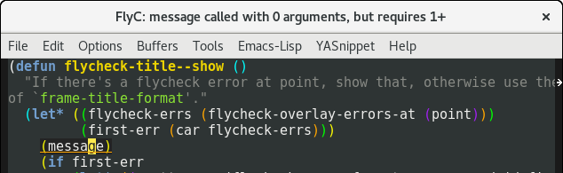
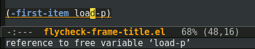
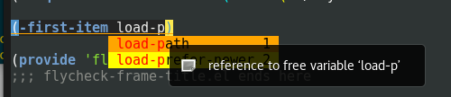

# flycheck-title



This package provides `flycheck-title-mode`, a minor mode that lets
you show flycheck errors in the window title (what Emacs calls the
'frame title').

## Existing approaches

Flycheck shows errors in the minibuffer by default. However, if
you're using eldoc, you get flicker:



An alternative is
[flycheck-pos-tip](https://github.com/flycheck/flycheck-pos-tip),
which shows the errors in a pop-up. This can be problematic when
you're using completion pop-ups:



## How do I install it?

Add `flycheck-title.el` to your `load-path`, then add the following to
your Emacs configuration:

``` emacs-lisp
(with-eval-after-load 'flycheck
  (flycheck-pos-tip-mode))
```

MELPA coming soon.
